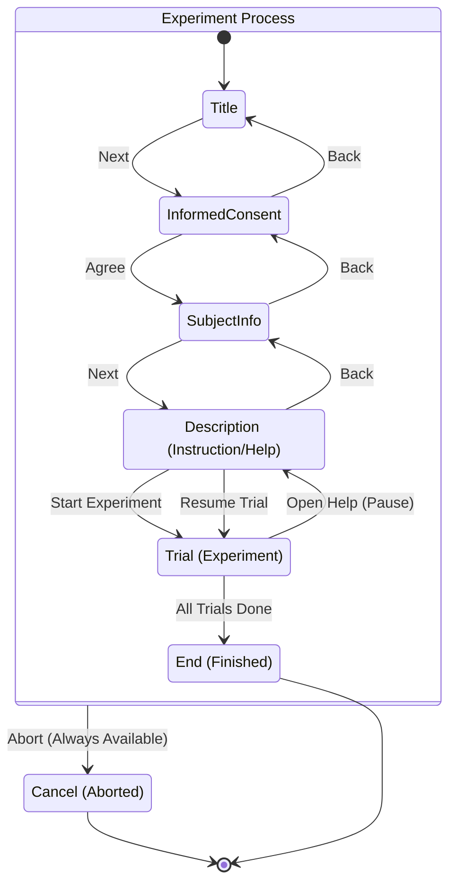

# 実験フロー図

```mermaid
stateDiagram-v2
    %% 終了状態の定義
    state "Cancel (Aborted)" as Cancel
    state "End (Finished)" as End

    %% 実験全体のプロセス
    state "Experiment Process" as MainLoop {
        [*] --> Title

        %% --- 初期設定フェーズ ---
        Title --> InformedConsent : Next
        InformedConsent --> Title : Back
        
        InformedConsent --> SubjectInfo : Agree
        SubjectInfo --> InformedConsent : Back

        %% --- 説明フェーズ（ここが変更点） ---
        %% Subject Infoの後に必ずDescription（説明）が入る
        SubjectInfo --> Description : Next
        Description --> SubjectInfo : Back

        %% --- 実験実施フェーズ ---
        state "Description (Instruction/Help)" as Description
        state "Trial (Experiment)" as Trial

        %% 説明画面から実験スタート
        Description --> Trial : Start Experiment

        %% 実験中のヘルプ参照（往来可能）
        Trial --> Description : Open Help (Pause)
        %% ※ここが「再開」の遷移
        Description --> Trial : Resume Trial

        %% 実験終了
        Trial --> End : All Trials Done
    }

    %% どこからでもESCキー等で中断可能
    MainLoop --> Cancel : Abort (Always Available)
    
    Cancel --> [*]
    End --> [*]
```